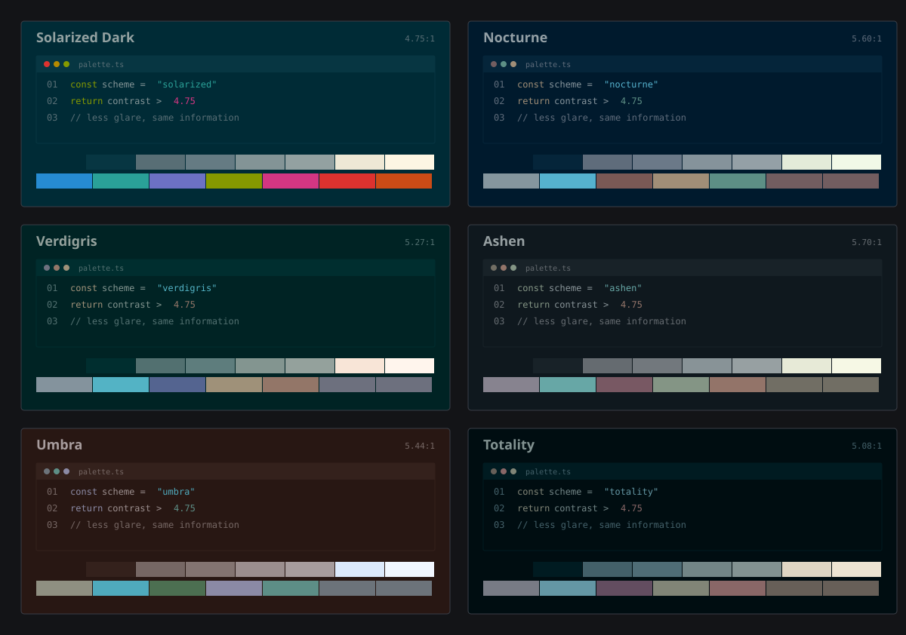

# Solar Eclipse

Five muted dark themes based on Solarized.

**Install:** [VS Code](vscode-colors-solar-eclipse/README.md) · [Obsidian](obsidian-colors-solar-eclipse/README.md) · [MarkText](marktext-colors-solar-eclipse/README.md)

Palette reference — hex values by role

Copy values below, or use the `colors` object for each theme in [schemes.json](schemes.json).

<!-- palettes:start -->

| role | Nocturne | Verdigris | Ashen | Umbra | Totality |
| --- | --- | --- | --- | --- | --- |
| background | `#001a2d` | `#012324` | `#0f181e` | `#1d1b19` | `#000d11` |
| highlight | `#05253a` | `#082e2f` | `#182228` | `#282523` | `#001b21` |
| comments | `#5f6c7b` | `#5a6e6e` | `#656b70` | `#6c6a69` | `#436069` |
| faint text | `#6b7988` | `#677b7c` | `#72787d` | `#797776` | `#4f6d76` |
| body text | `#8a9297` | `#8b9291` | `#979ca0` | `#9f9e9a` | `#7c8588` |
| bright text | `#999fa2` | `#989f9f` | `#a4a9ad` | `#acaba7` | `#899295` |
| pale | `#e3ebd9` | `#f8e5d7` | `#e7ead7` | `#e6e7fa` | `#dfd6c4` |
| palest | `#f1f9e7` | `#fff5ed` | `#f6f8e5` | `#f6f6ff` | `#ede4d2` |
| function names | `#7991a1` | `#7b90a6` | `#829aa3` | `#8499a5` | `#6e839c` |
| strings | `#4ca1b7` | `#4f9dba` | `#64a6a8` | `#6ca6bd` | `#4291a1` |
| special | `#8a779d` | `#6b83a0` | `#718d9a` | `#788e9f` | `#75739d` |
| keywords | `#a08b66` | `#5f979b` | `#709da6` | `#809cb4` | `#7e855e` |
| numbers | `#5b917b` | `#668aa7` | `#649796` | `#6a98a5` | `#98708d` |
| type names | `#5b917b` | `#668aa7` | `#649796` | `#6a98a5` | `#98708d` |
| errors | `#9b7884` | `#5d89a5` | `#6a93ac` | `#7797b6` | `#9e6a5d` |
| preprocessor | `#9b7884` | `#5d89a5` | `#6a93ac` | `#7797b6` | `#9e6a5d` |

| | Nocturne | Verdigris | Ashen | Umbra | Totality |
| --- | --- | --- | --- | --- | --- |
| text contrast | 5.6:1 | 5.22:1 | 6.48:1 | 6.4:1 | 5.22:1 |

<!-- palettes:end -->

